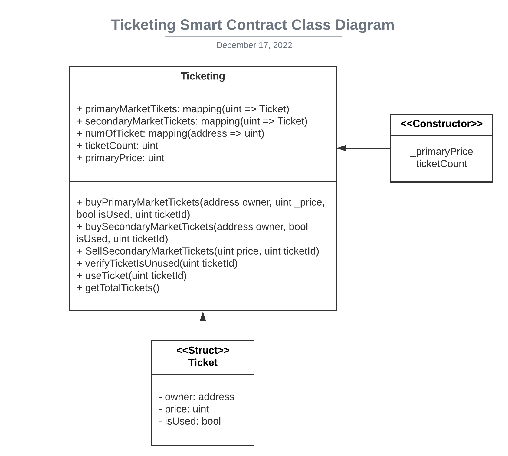
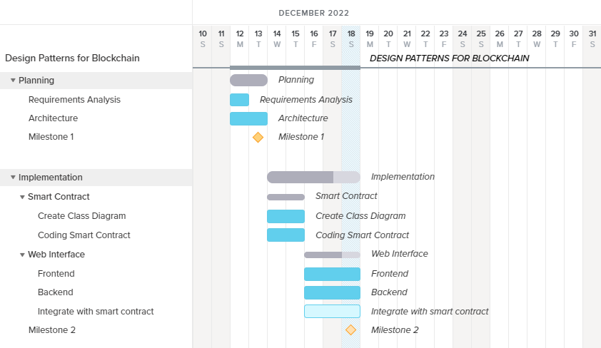

# Setup

1. Clone the project

```bash
git clone https://github.com/Henrywu96/Use-Case-Dapp.git
```

2. Install npm

```bash
npm install
```

3. Install hardhat

```bash
npm install --save-dev hardhat
```

4. Try running some of the following tasks:

```shell
npx hardhat help
npx hardhat test
REPORT_GAS=true npx hardhat test
npx hardhat node
npx hardhat run scripts/deploy.js
```

5. Install Metamask


## Use Case: Ticketing Dapp (Team Member: Min-Tzu Wu 101453248, Harshdeep Bedi 101442299)

- Problem statement
  - Entertainment companies do not have access to the information about their clients because a ticket is either a pdf file or a piece of paper with a barcode. Since scammers are a major concern in the secondary market because they take advantage of the lack of pricing transparency and the restricted number of tickets. It is frequently hard for purchasers on the secondary market to confirm that the ticket they are purchasing is real and has not been distributed in numerous copies to other consumers. Also, venue owners could not be aware of the actual venue’s patrons, either from the primary market or the secondary market.
- Goals
  - Provide total visibility of ticket information from the secondary market to all parties involved, resulting in more transparent and trusted purchasing of ticket.
- Stakeholders
  - Original & Secondary ticket buyers
  - Event organizers
  - Financers
  - Marketers
- Restrictions/rules
  - Tickets must be bought from the official website or mobile app
  - Tickets cannot be sold for more than it is purchased for from the organizer.
  - Tickets cannot be sold or redistributed during or after the event has passed (date).
  - If the ticket is invalid/ forged it will be invalidated and the issuing account of the ticket will be penalized.
- Data
  - Real ticket price
  - Access to ticket client info to company
  - Dealing secondary tickets sales
  - Restrict and control the tickets being sold if the ticket is invalid
  - Validating the authenticity of tickets being sold
  - Validating the ticket is from the primary or secondary market.
- Exceptions
  - Tickets can be sold or redistributed if the event has been canceled or rescheduled.
  - Tickets can be sold for more price than they were purchased for if the organizer updates ticket pricing.
- User stories
  - As a fan of this entertainment event, the user wants to be able to use a smart contract to purchase a ticket to an event, so that the user can be sure that their ticket is valid and that they can easily transfer it to a friend or sell it on the secondary market if necessary.
  - The user can click the connect MetaMask button to connect to their MetaMask account.
  - The user can click the dropdown menu to choose to buy a ticket from either the primary market or the secondary market.
  - The user can sell their unused ticket by selecting the sell link from the dropdown menu.
  - The user can click the button to purchase the ticket through metamask account.
  - The user can also click the button to sell the ticket using metamask to recieve funds.

## Architecture

- Project description
  - A system to track their customers’ data in order to engage and communicate to ticket holders.
- Functions - inputs/outputs
  - User interacts with our website/app which will allow our user to purchase event tickets using our platform, which essentially uses blockchain technology and does stuff to make sure everything is valid and good.
  - Our website/app will be used to buy the tickets from authentic sources for our user base.
  - Check remaining tickets available and push them to the secondary market.
  - Buyback your tickets from the secondary market if they are unable to sell them and penalize them for not fulfilling their duty.
  - Get the ticketId from the blockchain and put it in a random hash generator to nullify customer tickets.
- Class diagram
  
- Tech stack
  - Using React, Node.js, Solidity, and Web3.js

### Project Plan

- Breakdown of tasks
  - Planning
    - Task1: Requirement Analysis
    - Task2: Architecture
  - Implementation
    - Task1: Smart Contract
      - Subtask1: Create Class Diagram
      - Subtask2: Coding smart contract
    - Task2: Web Interface
      - Subtask1: Frontend
      - Subtask2: Backend
      - Subtask3: Integrate with smart contract
- Gantt chart

